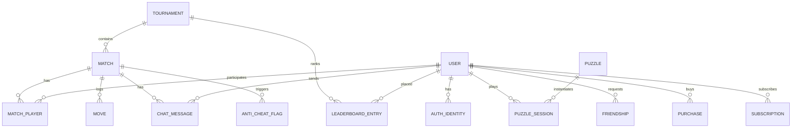
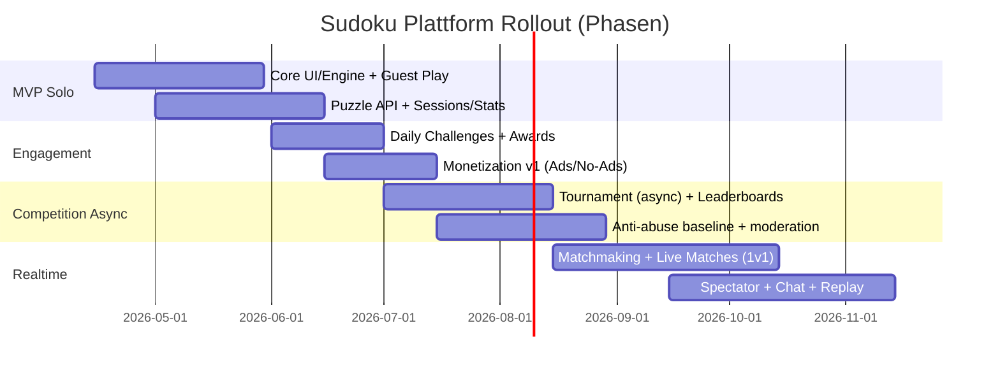

# Konzeption, Anforderungen und Architektur für eine Sudoku-Gaming-Website mit Echtzeit-Turniermodus

## Zusammenfassung

Diese Analyse beschreibt, wie eine Sudoku-Gaming-Website „ähnlich“ der deutschen Web-Version von Sudoku.com konzipiert und gebaut werden kann – inklusive eines **synchronen Multiplayer-Turniermodus**, in dem mehrere Spieler dasselbe Rätsel gleichzeitig lösen. Der Markt zeigt dabei ein relativ stabiles „Best-of“-Pattern: **komfortable Bedienhilfen** (Notizen/Pencil Marks, Undo, Radierer, Konflikt-/Duplikat-Markierung, Auto-Check, Hinweise), **Retention-Loops** (Daily Challenges, Events, Sammel-/Trophäen-Systeme) sowie **Wettbewerbsmechaniken** (Leaderboards, Turnierpunkte/Medaille) prägen die erfolgreichsten Angebote. citeturn3search0turn20search0turn20search13turn11view0turn3search9turn13search13

Eine belastbare technische Kernaussage ist: Für synchrones Multiplayer-Sudoku ist eine **server-autoritative Echtzeit-Architektur** (WebSocket-first, optional SignalR für Transport-Fallbacks) deutlich robuster als „Client-first“-Synchronisation. WebSockets sind ein standardisiertes, bidirektionales Protokoll; SignalR kann WebSockets nutzen und bei Bedarf auf Server-Sent Events bzw. Long Polling zurückfallen. citeturn4search0turn4search1turn21search0turn21search3

Für Content (Rätsel) ist der Engpass nicht das Lösen, sondern das **Generieren konsistenter, eindeutiger und gut kalibrierter Rätsel**. Dafür sind (a) ein schneller Solver (z. B. Algorithm X/Dancing Links), (b) eine eindeutige Lösungsprüfung (Uniqueness) und (c) eine Difficulty-Rating-Pipeline (z. B. modellierte „human-like“ Techniken) zentral. citeturn6search3turn5search3turn6search24turn18search3

Offene Parameter (bewusst nicht festgelegt): Zielplattformen (hier **Web-only angenommen**), Teamgröße, Budget und gewünschte Time-to-Market. Diese Faktoren steuern v. a. die Stack-Wahl (Monolith vs. Microservices, Managed Realtime wie Azure SignalR vs. Self-Hosted) und die Rollout-Phasen. citeturn21search2turn21search6turn9search0turn16search2

## Wettbewerbsanalyse und Markt

### Produktmuster bei etablierten Angeboten

**Sudoku.com (Deutsch, Web & App)** fokussiert stark auf „Frictionless Solving“: Notizen/Notizmodus, Hinweisfunktion, Radierer/Löschen sowie Hilfsfunktionen, die gerade bei höheren Schwierigkeitsgraden herausgestellt werden. citeturn3search8turn3search12turn3search0  
Zusätzlich sind **Daily Challenges** (Kalender/Archiv), **Awards/Trophäen** sowie **Turniere** als Competition-Layer prominent (Punkte → Leaderboard → Medaillen). citeturn20search13turn20search11turn20search0  
Monetär typisch: **Werbung + In-App-Käufe** (z. B. „No Ads“) sowie App-Privacy/Tracking-Signale (für Ad-Tech/Analytics relevant). citeturn11view0turn10view1

**entity["organization","Web Sudoku","sudoku website"]** ist ein klassisches Web-Angebot mit Fokus auf „pures“ Sudoku: Pencil Marking/Entwurfsfunktion via Optionen und eine „How am I doing?“-Hilfe statt vollständiger Lösungen; die deutsche FAQ erläutert explizit die Entwurfs-/Pencil-Mark-Logik und JavaScript-Abhängigkeit. citeturn13search13turn13search0  
Die Oberfläche zeigt zudem typische Web-Monetarisierung (Hinweis „Hide the advertisement below“) und einen eher konservativen Wettbewerbslayer (keine Echtzeit-Matches in den Kern-Quellen). citeturn13search4turn13search5

**entity["company","Microsoft","software company"]s** **entity["video_game","Microsoft Sudoku","puzzle game"]** positioniert sich als „Modi + Settings + Statistik“: Daily Challenges, mehrere Varianten (z. B. Irregular), Notizen, Radierer, Themes; dazu viele Settings wie „Block Duplicates“, „Show Mistakes“, „Show All Notes“ sowie Konto-Login (Cloud Save/Erfolge) und Statistiktracking. citeturn10view3turn3search9turn11view4  
Monetär: „Contains ads“ und „In-app purchases“ sind explizit ausgewiesen. citeturn11view4

**entity["organization","SudokuTournament.com","sudoku tournament app"]** ist aus Multiplayer-/Turnier-Sicht besonders relevant: In den Release Notes wird explizit beschrieben, dass Turnier-Play hinzugefügt wurde und man „denselben Puzzle-Code“ teilen kann, sodass mehrere Freunde **gleichzeitig** dasselbe Rätsel spielen. Dazu kommen Hilfsfeatures wie „Place note warning“ (Notiz-Constraint) und „Lock correct numbers“. citeturn10view2turn12view1turn11view3  
Monetär: In-App-Käufe (No Ads, Premium/Abos) sind vorhanden. citeturn11view3

**entity["organization","Sudokuonline.io","sudoku website and app"]** zeigt ein ausgearbeitetes Turnier-Scoring als Benchmark: Punkte = Basis-Schwierigkeit × Completion-Multiplikator × Hint-/Error-Penalty × Victory-Multiplikator; Zeit-Multiplikator und Max-Zeiten je Schwierigkeit werden dabei datenbasiert („defined based on thousands of games“) begründet. citeturn12view2turn20search19

image_group{"layout":"carousel","aspect_ratio":"16:9","query":["Sudoku.com interface screenshot notes hints","Web Sudoku pencil marking interface screenshot","Microsoft Sudoku game options block duplicates show mistakes screenshot","SudokuTournament.com app screenshot tournament","Sudoku online leaderboard tournament screenshot"],"num_per_query":1}

### Feature-Vergleich als „Design-Checkliste“

| Feature/Layer | Sudoku.com | Web Sudoku | Microsoft Sudoku | SudokuTournament.com | Sudokuonline.io | Zielprodukt (Soll) |
|---|---:|---:|---:|---:|---:|---:|
| Pencil Marks/Notizen | ✓ | ✓ | ✓ | ✓ | ✓ (implizit via Help/Scoring) | ✓ (mehrstufig) |
| Automatische Notiz-Updates | ✓ | (teilweise) | ✓ | ✓ (Hilfsfeatures) | – | ✓ (optional) |
| Conflict/Duplicate Highlight | ✓ | ✓ (Konflikt rot) | ✓ („Block Duplicates“) | ✓ (Note-Warn) | – | ✓ |
| Hint/Help | ✓ | ✓ („How am I doing?“) | ✓ | ✓ (Hilfen abschaltbar) | ✓ (Hint-Penalty) | ✓ (mit Turnier-Regeln) |
| Timer | ✓ | ✓ | ✓ | ✓ | ✓ (Zeit im Scoring) | ✓ (server-autorativ) |
| Stats/Progress | ✓ | ✓ (Statistiken erwähnt) | ✓ | ✓ (Stats/Leaderboards) | ✓ (Leaderboard-Metriken) | ✓ (inkl. Skill Rating) |
| Daily Challenges/Archiv | ✓ | – | ✓ | ✓ (Daily Challenges in Notes) | ✓ (Turnierzeiträume) | ✓ |
| Trophäen/Awards/Events | ✓ | – | (Badges/Coins) | – (Premium) | ✓ (Trophies) | ✓ |
| Asynchrones Turnier (Punkte sammeln) | ✓ | – | (teilweise) | ✓ (monatlich) | ✓ | ✓ |
| **Synchrones Match (gleiches Puzzle, live)** | (nicht Kernfokus der Web-Turnierbeschreibung) | – | – | ✓ (Code + gleichzeitig) | – | **✓ (Kernmodus)** |
| Werbung + No-Ads-Kauf | ✓ | ✓ | ✓ | ✓ | (variiert) | optional/konfigurierbar |

Die Tabelle ist aus öffentlich beschriebenen Funktionen/Store-Texten und UX-Dokumentation abgeleitet. citeturn3search8turn3search0turn20search0turn11view0turn13search13turn13search0turn10view3turn3search9turn11view4turn10view2turn12view2

**Markt-Implikation:** Der Erfolgsstandard ist „Singleplayer-first + Competition Layer“. Der klare Differenzierungshebel für ein neues Produkt ist ein sauber umgesetzter **Echtzeit-Modus** (Matchmaking, Spectator, Anti-Cheat, faire Wertung) – weil das in Web-First-Umsetzungen selten wirklich hochwertig angeboten wird und gleichzeitig hohe technische Eintrittsbarrieren hat. citeturn20search0turn12view2turn10view2turn4search0

## PRD und Funktionsanforderungen

### Produktvision, Ziele und offene Annahmen

**Vision:** „Das schnellste, fairste und sozialste Sudoku im Browser“ – mit einem kompetitiven Echtzeit-Ökosystem, ohne die Solo-Experience zu verschlechtern. (Ableitung aus den Retention-/Competition-Mechaniken erfolgreicher Produkte.) citeturn20search0turn20search13turn11view0turn12view2

**Primäre Ziele (Outcome-orientiert):**
- **Aha-Moment < 90 Sekunden:** Nutzer startet und beendet ein leichtes Sudoku im Browser ohne Login-Hürde (Guest). (Begründung: Web Sudoku/andere zeigen JavaScript-first + einfache Einstiegspfade; harte Login-Gates sind in Casual-Puzzles unüblich.) citeturn13search13turn20search6
- **Competition Activation:** Nutzer kann innerhalb einer Session in ein Turnier/Match wechseln (Leaderboard-Loop wie bei Sudoku.com/Sudokuonline). citeturn20search0turn12view2
- **Fairness/Trust:** Turnier- und Match-Ergebnisse sind nachvollziehbar und cheat-resistent (Server-Autorität, Logging, Anti-Abuse). citeturn8search8turn8search20turn4search0

**Offene Annahmen (bewusst nicht spezifiziert):**
- Plattformen: Web-only (Desktop + Mobile Web).  
- Team/Budget/Timeline: offen → Architektur muss „skalierbar, aber MVP-fähig“ sein (Start monolithisch, später modulieren). citeturn9search0turn16search2turn21search6

### Kern-Feature-Set (Singleplayer)

**Spielregeln & Validierung**
- 9×9 Standard-Sudoku (Classic) als Default; Erweiterungen (Irregular, Killer etc.) optional später. (Beobachtbar: Classic ist Basis; Varianten existieren bei Microsoft Sudoku und Sudoku.com.) citeturn10view3turn20search0
- Jede Puzzle-Instanz hat **genau eine Lösung** (Uniqueness). (Explizit in Sudoku.com App-Beschreibung.) citeturn3search5turn13search22

**UI/UX – zwingend für Parität**
- Eingabe-Modi: „Zelle → Zahl“ und optional „Zahl → Zelle“ (Microsoft Sudoku bietet beides). citeturn3search9  
- Toolbar: Undo/Redo, Radierer/Delete, Notizmodus (Pencil), Hint, Check/Fehleranzeige, Pause/Timer. (Direkt dokumentiert/impliziert durch Wettbewerber-UI- und Feature-Texte.) citeturn3search0turn10view3turn13search0turn12view3  
- Notizen/Pencil Marks:
  - Mehrere Kandidaten pro Zelle, visuell abgesetzt (kleiner, ggf. farblich). citeturn13search0turn13search13turn12view3
  - Optional: Auto-Notizen generieren (z. B. „Make pencil marks automatically“ bei 7sudoku-UI-Guide, bzw. Auto-Update bei Microsoft Sudoku/Sudoku.com). citeturn12view3turn10view3turn13search22
- Highlighting:
  - Gleiches Digit hervorheben; Konflikte/Fehler markieren; Duplikate blockieren/anzeigen. citeturn3search5turn12view3turn3search9turn13search0
- Komfort:
  - Tastaturkürzel (Ziffern, Notizmodus toggle, Undo, etc.), Mobile-Numpad, Touch-Optimierung. (Ableitung aus Web Sudoku/7sudoku UI-Guides und Web-Worker/JS-First Annahmen.) citeturn12view3turn13search0turn4search17

**Progress & Motivation**
- Daily Challenge-Kalender mit Archiv; Awards/Trophäen/Events. citeturn20search13turn20search11turn20search0
- Statistik (Bestzeit, Ø-Zeit, Mistakes, Games played) analog Microsoft Sudoku. citeturn3search9

### Account-System und Social Layer

**Account-Typen**
- Guest-Account (lokal + optional Cloud-Link später), E-Mail/Passwort, Social Login via OpenID Connect. citeturn14search2turn14search1  
- Passwortspeicherung: Argon2 (Argon2id-Variante als gängige Wahl) gemäß einschlägiger Spezifikation. citeturn4search3  
- Sessions/Tokens: JWT als Access Token, Refresh Token serverseitig rotierbar (optional); Standarddefinition JWT. citeturn14search3turn15search2

**Social Features (funktionsgetrieben)**
- Freundesliste, „Challenge a Friend“ (Puzzle-ID/Code), Activity Feed (neue Bestzeit, Turnierplatzierung). (Benchmark: SudokuTournament nutzt Puzzle-Code-Sharing; Sudoku.com/Sudokuonline nutzen Leaderboard-Loops.) citeturn10view2turn20search0turn12view2  
- Clubs/Gruppen (optional später): internes Ranking, Turnier-Teams.

### Turniermodus: asynchron und synchron (Echtzeit)

**Asynchrones Turnier (MVP-Competition)**
- Zeitraum (z. B. Woche), Punkte über gespielte Puzzles; Leaderboard + Medaillen/Trophäen. (Pattern: Sudoku.com Turniere, Sudokuonline Tournament.) citeturn20search0turn12view2  
- Scoring-Grundlage: Schwierigkeit, Completion, Time, Hint-/Error-Penalty – direkt als bewährtes Scoring-Modell bei Sudokuonline beschrieben. citeturn12view2

**Synchrones Echtzeit-Turnier (Kern-Differenzierung, v2/v3)**
- Match-Formate:
  - 1v1 „Duel“ (schnell, niedrige Queue-Zeit)
  - 4–8 Spieler „Arena“ (höhere Varianz, Spectator-freundlich)
  - Private Room via Code (analog SudokuTournament) citeturn10view2
- Ablauf:
  - Matchmaking → Lobby → Countdown → Live-Solving → Finish/Abandon → Ergebnis/Replay.
- Live-Features:
  - Echtzeit-Scoreboard, Completion-Status, Fehler/Hint-Indikatoren (je nach Fairness-Regeln).
  - Spectator Mode: Live-View (mit Delay), optional „Fog of Notes“ (Notizen nicht zeigen) um Ghosting zu reduzieren.
  - Chat: Lobby-Chat + In-Game-Chat (moderiert, Rate-Limited).

**Anti-Cheat (produkt- und architekturgetrieben)**
- Server-autoritative Zeitmessung (Startzeit/Endzeit serverseitig) + serverseitige Validierung jeder Aktion. (Echtzeitprotokoll: WebSocket/SignalR; Security-Modell u. a. Origin-basiert bei WebSockets.) citeturn4search0turn21search0  
- Scoring-Integrität: Hint-/Error-Penalties ausschließlich serverseitig berechnen (Benchmark-Formel zeigt, dass Penalties wesentlicher Bestandteil sind). citeturn12view2  
- Abuse Controls: Rate Limits, Anomalie-Erkennung (unmögliche Zeiten, perfekte Serien), Audit-Logging/Alerting (OWASP hebt Logging/Monitoring als kritischen Sicherheitsfaktor hervor). citeturn8search20turn8search8

### Wireframe-Skizzen (Text)

```text
[Startseite]
+--------------------------------------------------+
| Logo | "Schnelles Spiel"  [Daily] [Turnier]      |
|--------------------------------------------------|
| Schwierigk.:  Leicht Mittel Schwer Experte       |
| Modus: ( ) Classic  ( ) Irregular (später)        |
| [Start]   [Fortsetzen]   [Anmelden]              |
|--------------------------------------------------|
| "Heute" Daily Challenge | Platz #? im Turnier     |
+--------------------------------------------------+
```

```text
[Singleplayer Board]
+---------------------------+   +------------------+
| 9x9 Grid (selected cell)  |   | Score / Time     |
| row/col highlight         |   | Mistakes (opt.)  |
| conflicts in red          |   +------------------+
+---------------------------+   | Toolbar          |
| NumPad 1..9               |   | [Undo] [Redo]    |
| [Notes] toggle            |   | [Notes] [Erase]  |
| Candidates small in cell  |   | [Hint] [Check]   |
+---------------------------+   | [Pause]          |
                                +------------------+
```

```text
[Echtzeit-Match]
+---------------------------+  +--------------------+
| 9x9 Grid                  |  | Live-Scoreboard    |
| (Notes optional hidden    |  | P1  67%  Time 2:14 |
|  for spectators)          |  | P2  61%  Time 2:33 |
+---------------------------+  | P3  40%  Time 3:01 |
| Toolbar (limited)         |  +--------------------+
| [Notes] [Erase] [Undo]    |  | Chat (optional)    |
| [Hint disabled in Ranked] |  | ...                |
+---------------------------+  +--------------------+
```

Die UI-Elemente orientieren sich an häufig dokumentierten Controls (Undo/Erase/Notes/Timer/Highlight/Contraints) quer durch Wettbewerber und UX-Guides. citeturn3search0turn12view3turn13search0turn10view3turn10view2

## Sudoku-Engine und Content-Pipeline

### Solver-Baustein (für Uniqueness, Difficulty, Anti-Cheat-Faktencheck)

Ein leistungsfähiger Solver ist Kern-Infrastruktur für:
- Uniqueness-Check (genau 1 Lösung),
- Difficulty-Rating (wie „menschlich“/aufwendig),
- Server-Validierung (z. B. „ist das Endgitter korrekt“). citeturn6search3turn5search3turn6search24

**Algorithmische Basis:**  
- **Algorithm X + Dancing Links (DLX)** ist ein Standardansatz für Exact-Cover-Formulierungen und wurde von Donald Knuth ausführlich beschrieben. citeturn6search3turn6search0  
- Für Sudoku existieren zahlreiche Umsetzungen/Analysen, die DLX/Exact Cover als effizienten Solver-Mechanismus begründen. citeturn5search4turn5search6

### Generierung: Validität, Eindeutigkeit, Schwierigkeitskalibrierung

**Validität & Eindeutigkeit**
- Praktisch gängig ist: (1) vollständiges Lösungsgrid erzeugen, (2) Hinweise („clues“) entfernen, (3) nach jeder (oder batchweisen) Entfernung Uniqueness testen; dies wird in Forschungs-/Methodenarbeiten als Kernmuster beschrieben („repeatedly removes values… ensure solubility“). citeturn6search24turn5search22  
- Mathematischer Referenzpunkt: Ein klassisches Sudoku mit eindeutiger Lösung benötigt mindestens **17 clues**; 16-clue-Puzzles existieren nicht (computational proof). Das ist wichtig als Guardrail: sehr niedrige clue counts erhöhen Generator-Kosten und Risiko von Mehrdeutigkeit. citeturn18search3turn6search1

**Difficulty-Rating**
- Schwierigkeit ist nicht nur „wenige clues“, sondern korreliert mit der benötigten Art von logischen Techniken und dem Suchaufwand. Die Forschung diskutiert Difficulty-Metriken auf Basis von (a) Simulation „human-like“ Solving und (b) strukturellen Metriken; Pelánek zeigt z. B. Difficulty-Rating via Modellierung menschlicher Solver/Techniken. citeturn5search3turn5search19  
- Neuere Arbeiten thematisieren explizit, dass Website-Labels inkonsistent sein können und schlagen universelle Mapping-Ansätze vor (wichtig für „ehrliche“ Schwierigkeitsstufen im Produkt). citeturn5search7  
- Für ein Produkt mit Competitive Layer ist die Rating-Qualität unmittelbar monetarisierungs- und fairnessrelevant (Scoring/Queue-Balancing). citeturn12view2turn20search0

**Kalibrierungs-Strategie (empfohlen)**
- Kombiniere zwei Scores:
  1) **Technique Score**: gewichtete Anzahl/Art erforderlicher Techniken (Singles → Pairs → …), gemessen via solver, der diese Techniken implementiert (vgl. human-solver-basierte Difficulty-Forschung). citeturn5search3turn5search19  
  2) **Search Score**: bei Bedarf begrenztes Backtracking (Nishio/Hybrid) als Residualmaß für „nicht durch einfache Logik lösbar“ (Difficulty-Rating-Überblick diskutiert solche Klassen von Metriken). citeturn5search19turn5search7  
- Mappe daraus interne Tiers (z. B. Easy/Medium/Hard/Expert/Master) und validiere gegen echte Spieltelemetrie (Medianzeit, Hint-Rate, Error-Rate) – analog der datengestützten Zeit-/Difficulty-Begründung im Turniermodell von Sudokuonline. citeturn12view2

### Seeding, Storage, Versionierung der Rätsel

**Seeding/Reproduzierbarkeit**
- Für Turniere/Matches muss „gleiches Rätsel“ zuverlässig reproduzierbar sein: Speichere Puzzle als (givens + solution) oder als kompaktes Encoding (81 chars) plus „generator_version“ + optional PRNG-seed. (Reproduzierbarkeit ist produktkritisch für synchrones Spielen; SudokuTournament nutzt Puzzle-Codes als User-Level Konzept.) citeturn10view2

**Storage**
- Persistiere pro Puzzle mindestens:
  - puzzle_id, variant, givens_encoding, solution_hash/solution_encoding, difficulty_tier, difficulty_score(s), symmetry_flag, generator_version, created_at.
- Für Telemetrie: anonymisierte Aggregate pro puzzle_id (solve_time distribution etc.) zur Rekalibrierung. (Sudokuonline weist Scoring-Maxzeiten auf Basis „thousands of games“ aus – dies erfordert genau solche Datenpipelines.) citeturn12view2

### Content-Pipeline als Fluss

```mermaid
flowchart LR
  A[Puzzle-Request / Batch-Job] --> B[Generate full solution grid]
  B --> C[Remove clues (symmetry optional)]
  C --> D[Uniqueness check: count solutions up to 2]
  D -->|fail| C
  D -->|pass| E[Difficulty rating (human-techniques + search)]
  E --> F[Persist: puzzle + metadata + version]
  F --> G[Publish via API: daily pool / matchmaking pool]
  G --> H[Telemetry: solve times, hints, errors]
  H --> E
```

Der Ablauf folgt etablierten Generatorprinzipien (Value-Removal + Solvability/Uniqueness) und ergänzt Difficulty-Rating-Schleifen, wie sie in Difficulty-Forschung und datenbasierten Turniermodellen nahegelegt sind. citeturn6search24turn5search3turn18search3turn12view2

## Architektur, Datenmodell und API-Design

### Systemüberblick (Web-only, Echtzeitfähig)

**Referenzarchitektur (empfohlen für Web-only)**
- Frontend: SPA (React/Vue/Svelte) + Web Worker für rechenintensive UI-Features (z. B. lokale Candidate-Rekalkulation, ohne UI zu blockieren). citeturn4search17  
- Backend (API): REST/JSON + OpenAPI Beschreibung (Standard für HTTP APIs). citeturn14search4  
- Realtime: WebSocket-first; optional SignalR für automatische Transportwahl/Fallback (WebSockets → SSE → Long Polling). citeturn4search0turn4search1turn21search0turn21search3  
- Storage: relational (z. B. PostgreSQL) + Cache/Realtime-Backplane (Redis). (Redis Pub/Sub ist at-most-once; für „reliable events“ Streams/JetStream/Kafka erwägen.) citeturn8search3turn17search0turn17search2turn17search3

### Backend-Stack-Optionen (pragmatischer Vergleich)

| Option | Stärken | Risiken/Trade-offs | Geeignet wenn… |
|---|---|---|---|
| Node.js/TypeScript (z. B. Nest) | Sehr schnell für Web-Teams; gutes WS-Ökosystem | CPU-bound Sudoku-Rating ggf. Worker/Separate Service nötig | kleines Team, hohe Iterationsrate |
| .NET (ASP.NET Core + SignalR) | Realtime-„aus einem Guss“ (SignalR), gute Observability/Hosting-Story | Team-Skill notwendig; ggf. weniger „Frontend-nah“ | Realtime/Enterprise-Stack gewünscht citeturn21search0turn21search6 |
| Go | gute Latenz/Performance, einfache Deployments | Produktivität bei komplexer Business-Logik variiert | performancekritische Realtime-Services |
| Java (Spring) | reif, skalierbar, Observability | schwergewichtiger für MVP | größere Teams/Compliance-heavy |

Die SignalR-spezifischen Aussagen basieren auf offizieller Dokumentation zu Transporten und Skalierung. citeturn21search0turn21search6turn21search2

### Realtime-Technologie-Entscheidung (WebSocket vs SSE vs WebRTC vs SignalR)

**WebSocket**: bidirektional, dauerhaft, für „Moves“ und Chat ideal; Sicherheitsmodell ist browser-origin-basiert. citeturn4search0turn4search1  
**SSE (EventSource)**: server→client push, einfacher als WebSocket, aber nicht bidirektional; EventSource-API ist standardisiert dokumentiert. citeturn21search3turn21search11  
**SignalR**: Abstraktionslayer, der WebSockets bevorzugt und fallbackt; zusätzlich Production-Scaling-Patterns (inkl. Azure SignalR). citeturn21search0turn21search6turn21search2  
**WebRTC**: APIs zur Echtzeitkommunikation zwischen Browsern, aber für „server-autorative Competitive Games“ in der Regel unnötig komplex (NAT traversal etc.); Spezifikation definiert APIs für Media und Data. citeturn4search6turn4search13

**Empfehlung:** WebSocket-first (oder SignalR als Framework) und server-autoratives State-Management; SSE nur als optionaler Fallback/Read-Only Channel (z. B. Spectator-Stream). citeturn4search0turn21search0turn21search3

### Skalierung: Zustandsmanagement, Backplane, Kubernetes

**Kubernetes als Standardplattform (Option)**
- Horizontal Pod Autoscaler skaliert Workloads automatisch anhand beobachteter Metriken; es existiert auch eine deutsche Doku-Seite. citeturn9search0turn9search8  
- Ingress nutzt TLS-Termination am Ingress-Punkt (Port 443) und multiplexed Hosts via SNI; relevant für sichere Web-Endpoints. citeturn9search1  
- NetworkPolicy erlaubt Default-Deny Ingress/Egress – wichtig gegen laterale Bewegungen. citeturn9search29

**Realtime-Scale-Out**
- Redis Pub/Sub ist leichtgewichtig, aber „at-most-once“; für Realtime-Game-Events ist das akzeptabel, wenn Clients bei Paketverlust „Resync“ machen können. citeturn8search3  
- Für verlässlichere Event-Verarbeitung: Redis Streams (acks/consumer groups) oder JetStream/Kafka für persistente QoS. citeturn17search1turn17search2turn17search3

### Datenmodell (ER) – Kernobjekte für Solo + Multiplayer



Das Modell spiegelt die funktionalen Anforderungen wider (Sessions/Stats, Matches, Moves für Anti-Cheat/Replay, Chat, Monetization). Die zugrundeliegenden Sicherheits- und Skalierungsüberlegungen sind an OWASP (Risiken/Logging) sowie Realtime-Transport/Backplane-Dokumentation ausgerichtet. citeturn8search8turn8search20turn4search0turn17search1

### API-Design: REST + Realtime-Protokoll

**REST (Beispiele, v1)**
- `GET /api/v1/puzzles/random?difficulty=easy` → Puzzle (givens), meta
- `GET /api/v1/puzzles/{puzzle_id}` → Puzzle + difficulty meta
- `POST /api/v1/sessions` → Puzzle-Session starten (für Stats)
- `POST /api/v1/sessions/{id}/complete` → Completion (time, mistakes, hints_used)
- `GET /api/v1/leaderboards/tournament/{tournament_id}` → Rankings
- `POST /api/v1/matches/queue` → matchmaking join (wenn nicht WS-negotiated)

Die API wird idealerweise als OpenAPI beschrieben (Standard für HTTP APIs). citeturn14search4

**Realtime (WebSocket/SignalR) – Event-Typen**
- `match.found` {match_id, start_at, puzzle_id, ruleset}
- `match.start` {server_time}
- `move.submit` {seq, cell, value, mode: pen|pencil}
- `state.delta` {seq, changed_cells, conflicts, progress_pct}
- `score.update` {player_id, progress_pct, mistakes, hints, server_elapsed_ms}
- `chat.message` {channel, text, moderation_flags}
- `match.finish` {rank, final_time, score, audit_token}

WebSockets sind explizit für bidirektionale Sessions gedacht; SignalR dokumentiert Transport-Fallbacks, was für mobile Netze hilfreich ist. citeturn4search0turn21search0turn21search3

### Sicherheit, Datenschutz, Compliance (Web, EU/DE)

**AppSec-Baseline**
- OWASP Top 10 (aktuelle Edition) als Risiko-Referenz (Access Control, Misconfiguration, Supply Chain, Logging/Alerting etc.). citeturn8search0turn8search4turn8search8  
- Content Security Policy (CSP) zur Reduktion von XSS/Injection-Risiken ist auf MDN als Schutzmechanismus beschrieben. citeturn7search3turn7search7

**Auth**
- OAuth 2.0 Framework (Delegation) und OpenID Connect (Authentication Layer) sind standardisiert. citeturn14search1turn14search2  
- PKCE schützt gegen Authorization Code Interception Attack bei Public Clients (z. B. SPA). citeturn15search0  
- OAuth Security Best Current Practice (RFC 9700) liefert aktualisierte Security Guidance. citeturn15search2  
- Passwort-Hashing: Argon2 Spezifikation (RFC 9106). citeturn4search3

**Cookies/Tracking (DE/EU)**
- DSGVO ist die zentrale Rechtsgrundlage für personenbezogene Datenverarbeitung. citeturn7search0turn7search4  
- In DE sind Cookies/Endgerätezugriffe für nicht notwendige Zwecke typischerweise einwilligungspflichtig; Datenschutzaufsicht BW formuliert dies direkt unter Verweis auf §25 TTDSG. citeturn7search37  
- Für Ad-Tech/Programmatic kann das **entity["organization","IAB Europe","ad industry org"]** Transparency & Consent Framework (TCF) als Standardisierungsschicht dienen; v2.2 ist als Launch dokumentiert. citeturn7search2turn7search10  
- Sichere Cookie-Konfiguration (SameSite etc.) ist auf MDN als praktische Security Guidance beschrieben. citeturn15search19turn15search3

### Deployment, CI/CD, Observability, Tests

**Container & CI/CD**
- Container-Images: Docker Best Practices empfehlen u. a. kleine Base Images zur Reduktion von Angriffsfläche. citeturn16search3  
- CI/CD: **entity["company","GitHub","code hosting company"]** Actions ist als CI/CD-Plattform dokumentiert (Workflows bauen, testen, deployen). citeturn16search2turn16search6turn16search14  
- K8s: HPA/Ingress/NetworkPolicy für Skalierung und Security-by-default. citeturn9search0turn9search1turn9search29

**Observability**
- OpenTelemetry spezifiziert Signale (Logs/Traces/Metrics) und Correlation über Resource-Kontext. citeturn9search2turn9search6turn9search14  
- Prometheus erklärt Histogramme/Summaries als Metriktypen (z. B. Latenzen, Queue-Zeiten). citeturn9search3turn9search7

**Testing**
- E2E: Playwright ist als Cross-Browser E2E-Framework positioniert; Cypress dokumentiert E2E-Tests mit realem Browser-Verhalten. citeturn16search0turn16search13turn16search1  
- Für Multiplayer: zusätzliche „Determinism Tests“ (Match-Replay aus Move-Log ergibt identisches Ergebnis) + Load Tests für WS-Fanout (Backplane/Shard). (Redis Pub/Sub Semantik und Streams-Acks helfen bei Testdesign für Eventzustellung.) citeturn8search3turn17search1

## Roadmap, Aufwand, KPIs und Betrieb

### Phasen-Rollout (realistisch für Web-only, offene Teamgröße)



Der Realtime-Part ist bewusst nachgelagert, weil Turnier-/Leaderboard-Mechaniken in bestehenden Produkten bereits ohne Live-Matches funktionieren und monetarisierbar sind (Sudoku.com/„Tournament“, Sudokuonline Scoring). citeturn20search0turn12view2turn11view0

### Aufwand/Komplexität (grob, unabhängig von Teamgröße)

| Epics | Komplexität | Haupt-Risiken | Abhängigkeiten |
|---|---|---|---|
| Core Sudoku UI (Notes/Highlight/Undo) | Mittel | UX-Qualität/Performance | Web Worker, State mgmt citeturn4search17turn12view3 |
| Generator + Difficulty Rating | Hoch | Uniqueness + Label-Konsistenz | DLX Solver, Rating-Forschung citeturn6search3turn5search3turn18search3 |
| Accounts + Auth | Mittel | Security/Token Handling | OIDC/OAuth/PKCE/Argon2 citeturn14search2turn15search0turn4search3 |
| Async Turniere + Leaderboards | Mittel | Scoring-Fairness | Scoring-Formel/Telemetry citeturn12view2turn20search0 |
| Echtzeit-Matches + Matchmaking | Hoch | Skalierung, Cheating, Latenz | WebSocket/SignalR + Backplane citeturn4search0turn21search0turn8search3 |
| Spectator + Chat + Moderation | Mittel–Hoch | Abuse/Privacy | Rate limits + Logging + CSP citeturn8search20turn7search3 |

### KPIs (vorgeschlagene „North Stars“ pro Layer)

- **Core:** Completion Rate pro Difficulty, Median Solve Time, Mistake Rate, Hint Usage Rate. (Direkt anschlussfähig an Turnier-Scoring mit Penalties und Completion-Zählung.) citeturn12view2  
- **Engagement:** Daily Challenge Return Rate, Award-Completion Funnel. (Daily Challenge/Awards sind bei Sudoku.com zentrale Loop-Bausteine.) citeturn20search13turn20search11  
- **Competition:** Turnier-Teilnahmequote, Leaderboard-Views pro User, Ranked-Match Queue Time, Match-Abbruchquote. (Leaderboards/Turniere sind zentral bei Sudoku.com/Sudokuonline/SudokuTournament.) citeturn20search0turn12view2turn12view1  
- **Trust & Safety:** Anteil „flagged“ Matches, False-Positive-Rate, Time-to-Resolve Support Tickets; Logging/Monitoring ist dafür Kernvoraussetzung (OWASP). citeturn8search20turn8search8

### Monetarisierung (Optionen + Compliance-Hinweise)

- **Ads (Web/App):** Banner/Interstitial – aber **nicht** in Ranked Live Matches (Fairness/Abbruchrisiko); Wettbewerber weisen Ads häufig explizit aus. citeturn11view0turn11view4turn13search4  
- **No-Ads / Premium-Abo:** klarer, bewährter Purchase-Path (bei Sudoku.com als IAP „No Ads“, bei SudokuTournament Premium/Abos). citeturn11view0turn11view3  
- **Cosmetics:** Themes, Avatare, Emotes (geringes Pay-to-Win-Risiko).
- **Competitive Pass:** z. B. „Season Pass“ mit kosmetischen Rewards statt Gameplay-Vorteilen (orientiert an Medaillen/Trophäen-Mechaniken). citeturn20search0turn20search11  
- **Datenschutz/Consent:** Tracking/Marketing-Cookies regelmäßig einwilligungspflichtig; Datenschutzaufsicht verweist auf §25 TTDSG, DSGVO bleibt Basis. citeturn7search37turn7search0  
- Optionaler Branchenstandard: TCF v2.2 von entity["organization","IAB Europe","ad industry org"] für Vendor-/Consent-Signale. citeturn7search2turn7search10

